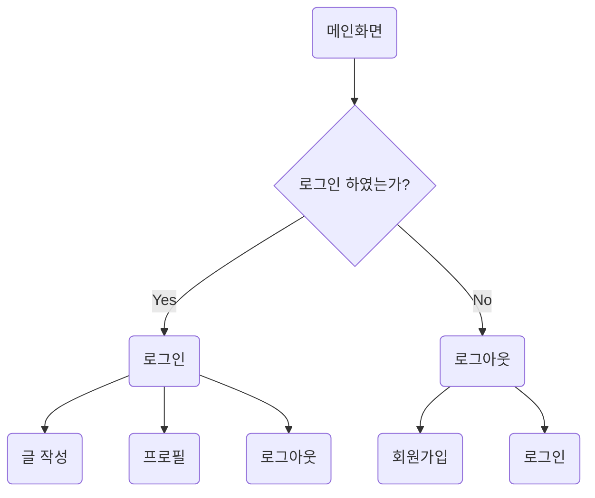
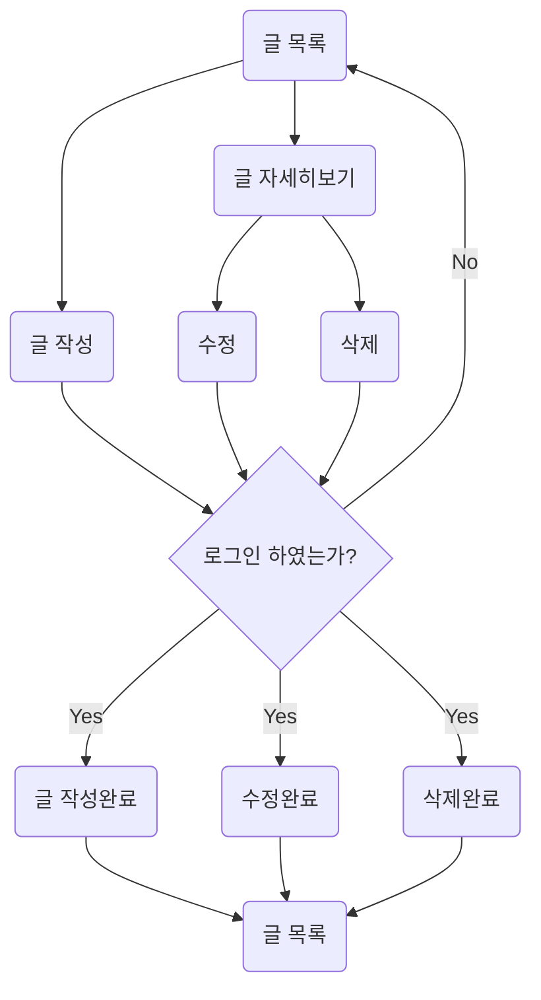

# My First Blog
- Django framework를 이용한 블로그 제작 프로젝트입니다.

# 목차
---

* [1. 목표와 기능](#1-목표와-기능)
* [2. 개발 환경](#2-개발-환경)
* [3. 프로젝트 구조와 개발 일정](#3-프로젝트-구조와-개발-일정)
* [4. UI 및 메인 기능](#4-ui-및-메인-기능)
* [5. 데이터베이스 모델링](#5-데이터베이스-모델링)
* [6. 버그 리포트](#6-버그-리포트)
* [7. 개발하며 느낀점](#7-개발하며-느낀점)

## 1. 목표와 기능

### 1-1. 목표
- 요리 블로그로서 다양한 사람들이 보다 손쉽게 레시피를 얻을 수 있도록 서비스하는것

### 1-2. 기능
- 여러가지 자유롭게 글을 쓸 수 있는 게시판
- 음식 레시피를 유저들이 적으면 태그나 검색 기능을 통해 찾아서 볼 수 있는것
- 로그인 시 댓글이 작성 가능하다.

## 2. 개발 환경

- 개발 툴
  - Visual Studio Code 1.84.0

- Web Framework
  - Django 4.2.6

- FE
  - HTML
  - JavaScript
  - CSS
  - Bootstrap 5.3.2

- BE
  - Python 3.12.0
  - pip 23.3.1
  - asgiref 3.7.2
  - Pillow 10.1.0
  - sqlparse 0.4.4
  - tzdata 2023.3


## 3. 프로젝트 구조와 개발 일정
### 3-1. 프로젝트 구조
```bash
📦MyFirstBlog
 ┣ 📂accounts
 ┃ ┣ 📂migrations
 ┃ ┣ 📂__pycache__
 ┃ ┣ 📜admin.py
 ┃ ┣ 📜apps.py
 ┃ ┣ 📜forms.py
 ┃ ┣ 📜models.py
 ┃ ┣ 📜tests.py
 ┃ ┣ 📜urls.py
 ┃ ┣ 📜views.py
 ┃ ┗ 📜__init__.py
 ┣ 📂blog
 ┃ ┣ 📂migrations
 ┃ ┣ 📂__pycache__
 ┃ ┣ 📜admin.py
 ┃ ┣ 📜apps.py
 ┃ ┣ 📜forms.py
 ┃ ┣ 📜models.py
 ┃ ┣ 📜tests.py
 ┃ ┣ 📜urls.py
 ┃ ┣ 📜views.py
 ┃ ┗ 📜__init__.py
 ┣ 📂main
 ┃ ┣ 📂migrations
 ┃ ┣ 📂__pycache__
 ┃ ┣ 📜admin.py
 ┃ ┣ 📜apps.py
 ┃ ┣ 📜forms.py
 ┃ ┣ 📜models.py
 ┃ ┣ 📜tests.py
 ┃ ┣ 📜urls.py
 ┃ ┣ 📜views.py
 ┃ ┗ 📜__init__.py
 ┣ 📂media
 ┃ ┣ 📂accounts
 ┃ ┃ ┗ 📂images
 ┃ ┃ ┃ ┣ 📂user_username
 ┃ ┃ ┃ ┃ ┗ 📜profile_img.jpg
 ┃ ┗ 📂blog
 ┃ ┃ ┗ 📂images
 ┃ ┃ ┃ ┗ 📂Year
 ┃ ┃ ┃ ┃ ┣ 📂Month
 ┃ ┃ ┃ ┃ ┃ ┣ 📂Day
 ┃ ┃ ┃ ┃ ┃ ┃ ┗ 📜thumnail_img.jpg
 ┣ 📂MyFirstblog
 ┃ ┣ 📂__pycache__
 ┃ ┣ 📜asgi.py
 ┃ ┣ 📜settings.py
 ┃ ┣ 📜urls.py
 ┃ ┣ 📜wsgi.py
 ┃ ┗ 📜__init__.py
 ┣ 📂static
 ┃ ┣ 📂assets
 ┃ ┣ 📂css
 ┃ ┣ 📂images
 ┃ ┗ 📂js
 ┣ 📂templates
 ┃ ┣ 📂accounts
 ┃ ┃ ┣ 📜login.html
 ┃ ┃ ┣ 📜profile.html
 ┃ ┃ ┗ 📜register.html
 ┃ ┣ 📂blog
 ┃ ┃ ┣ 📜post_404.html
 ┃ ┃ ┣ 📜post_confirm_delete.html
 ┃ ┃ ┣ 📜post_detail.html
 ┃ ┃ ┣ 📜post_form.html
 ┃ ┃ ┗ 📜post_list.html
 ┃ ┣ 📂main
 ┃ ┃ ┗ 📜index.html
 ┃ ┗ 📜base.html
 ┣ 📜db.sqlite3
 ┗ 📜manage.py
```
### 3-2. URL 구조


|app : main             |views 함수 이름            |html 파일이름             |
|:----------------------|:--------------------------|:--------------------------|
|'/'                    |index                      |index.html                 |

|app : accounts         |views 함수 이름            |html 파일이름             |
|:----------------------|:--------------------------|:--------------------------|
|'login/'               |login                      |login.html                 |
|'logout/'              |logout                     |
|'register/'            |register                   |register.html              |
|'profile/'             |profile                    |profile.html               |

|app : blog             |views 클래스 이름          |html 파일이름                |
|:----------------------|:--------------------------|:--------------------------|
|'/'                    |PostList.as_view()         |post_list.html             |
|'\<int:pk\>/'          |PostDetail.as_view()       |post_detail.html           |
|'search/'              |PostSearch.as_view()       |post_list.html             |
|'search/\<str:tag\>/'  |PostSearchTag.as_view()    |post_list.html             |
|'write/'               |PostCreateView.as_view()   |post_form.html             |
|'edit/\<int:pk\>/'     |PostUpdateView.as_view()   |post_form.html             |
|'delete/\<int:pk\>/'   |PostDeleteView.as_view()   |post_confirm_delete.html   |


### 3-3. 개발 일정
* 일정표는 https://www.notion.so/ 에서 작성되었습니다.
* 관련된 스택 표시는 https://github.com/ 에서 작성되었습니다.


## 4. UI 및 메인 기능

### 4-1. main

- 메인 화면입니다. 가장 최신의 글 6개가 올라오게됩니다. 각 글을 클릭하면 글의 페이지로 이동하게됩니다.


### 4-2. accounts

- 로그인을 하게 되면 상단 네비바가 변경되며, 글 작성과 로그아웃, 프로필 기능이 활성화됩니다.


- 만약 url 등을 이용해 강제로 페이지에 들어갈경우, 다른 페이지로 튕겨져 나옵니다.


- 회원가입하는 기능입니다. 로그인이 되어있으면 작동하지 않습니다.


- 로그인하는 기능입니다.


### 4-3. blog

- 글 목록입니다. 기본적인 페이징 기능이 있습니다.


- 특정 키워드를 이용해 검색하거나, 카테고리 명을 클릭하면 해당 카테고리를 가진 글 목록으로 이동합니다.


- 글을 작성하는 기능입니다. 카테고리는 체크박스로 적용됩니다.


- 글을 수정하거나 삭제 시 작성자만 가능하게 하였습니다.


- 혹시 의견이 달고싶으면 댓글 작성 또한 가능합니다.




- 글 작성



## 5. 데이터베이스 모델링


## 6. 버그 리포트

### 6-1. M:N관계 데이터가 입력되지 않는 오류

- Q. 평소처럼 단순히 form으로 받아서 save를 하면 텅 빈 자료가 전송되는 오류가 있었습니다.

- A. html의 체크박스 value에는 숫자로 집어넣엇고, form.save_m2m()으로 M:N관계의 데이터는 따로 저장해서 적용시켰습니다.

```python
    def post(self, request):
    form = PostForm(request.POST, request.FILES)
    if form.is_valid():
        post = form.save(commit=False)
        post.author = request.user
        post.save()
        form.save_m2m()
    return redirect("post_list")
```

### 6-2. 회원가입을 할 떄, 비밀번호가 해싱되지 않는 오류

- Q. Abstractuser를 상속받아 따로 유저폼을 만들어서 회원가입을 했더니 비밀번호가 제대로 들어오지 않았습니다.

- A. user.set_password()를 이용하여 비밀번호 암호화 처리를 해야만 제대로 사용이 가능한 비밀번호가 작성됩니다.

```python
    def post(self, request):
    form = UserForm(request.POST, request.FILES)
    if form.is_valid():
        print(form.cleaned_data)
        user = form.save(commit=False)
        user.set_password(form.cleaned_data["password"])
        user.save()
        return redirect("post_list")
```

## 7. 개발하며 느낀점
- 버그 리포트를 기능 구현마다 꾸준히 쓰고, 기능 하나당 커밋 하나를 생활화 하는게 중요한 것 같다 아직 습관화가 안되있어서 정신없이 코딩하다보면 잊어버린다.

- 믹스인 등 이미 구현된 클래스를 불러와 돌리는건 간편해서 좋지만 수정하거나 오류가 뜨면 구조를 모르는것이 맹점으로 다가와 해결하기 과하게 어려워진다.

