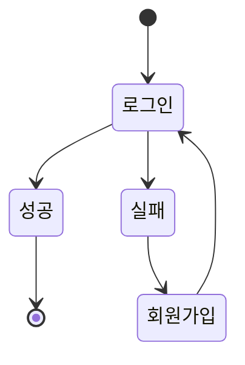

# My First Blog
- Django framework를 이용한 블로그 제작 프로젝트입니다.


## 1. 목표와 기능

### 1.1 목표
- 요리 블로그로서 다양한 사람들이 보다 손쉽게 레시피를 얻을 수 있도록 서비스하는것

### 1.2 기능
- 여러가지 자유롭게 글을 쓸 수 있는 게시판
- 음식 레시피를 유저들이 적으면 태그나 검색 기능을 통해 찾아서 볼 수 있는것
- 로그인 시 댓글이 작성 가능하다.

## 2. 개발 환경 및 배포 URL
### 2.1 개발 환경
- Web Framework
  - Django 4.2.6 (Python 3.12.0)

## 3. 프로젝트 구조와 개발 일정
### 3.1 프로젝트 구조
```bash
C:.
|   db.sqlite3
|   manage.py
|   tree.txt
|   
+---accounts
|   |   admin.py
|   |   apps.py
|   |   forms.py
|   |   models.py
|   |   tests.py
|   |   urls.py
|   |   views.py
|   |   __init__.py
|   |   
|   +---migrations
|   |   |   0001_initial.py
|   |   |   0002_user_profile_img.py
|   |   |   __init__.py
|   |   |   
|   |   \---__pycache__
|   |           0001_initial.cpython-312.pyc
|   |           0002_user_profile_img.cpython-312.pyc
|   |           __init__.cpython-312.pyc
|   |           
|   \---__pycache__
|           admin.cpython-312.pyc
|           apps.cpython-312.pyc
|           forms.cpython-312.pyc
|           models.cpython-312.pyc
|           urls.cpython-312.pyc
|           views.cpython-312.pyc
|           __init__.cpython-312.pyc
|           
+---blog
|   |   admin.py
|   |   apps.py
|   |   forms.py
|   |   models.py
|   |   tests.py
|   |   urls.py
|   |   views.py
|   |   __init__.py
|   |   
|   +---migrations
|   |   |   0001_initial.py
|   |   |   0002_post_next_post_post_previous_post.py
|   |   |   __init__.py
|   |   |   
|   |   \---__pycache__
|   |           0001_initial.cpython-312.pyc
|   |           0002_post_next_post_post_previous_post.cpython-312.pyc
|   |           __init__.cpython-312.pyc
|   |           
|   \---__pycache__
|           admin.cpython-312.pyc
|           apps.cpython-312.pyc
|           forms.cpython-312.pyc
|           models.cpython-312.pyc
|           urls.cpython-312.pyc
|           views.cpython-312.pyc
|           __init__.cpython-312.pyc
|           
+---main
|   |   admin.py
|   |   apps.py
|   |   forms.py
|   |   models.py
|   |   tests.py
|   |   urls.py
|   |   views.py
|   |   __init__.py
|   |   
|   +---migrations
|   |   |   __init__.py
|   |   |   
|   |   \---__pycache__
|   |           __init__.cpython-312.pyc
|   |           
|   \---__pycache__
|           admin.cpython-312.pyc
|           apps.cpython-312.pyc
|           models.cpython-312.pyc
|           urls.cpython-312.pyc
|           views.cpython-312.pyc
|           __init__.cpython-312.pyc
|           
+---media
|   +---accounts
|   |   \---images
|   |       \---user_username
|   |               profile_img.jpg
|   |               
|   \---blog
|       \---images
|           \---yyyy
|               \---mm
|                   \---dd
|                           img.jpg
|                           
+---MyFirstblog
|   |   asgi.py
|   |   settings.py
|   |   urls.py
|   |   wsgi.py
|   |   __init__.py
|   |   
|   \---__pycache__
|           settings.cpython-312.pyc
|           urls.cpython-312.pyc
|           wsgi.cpython-312.pyc
|           __init__.cpython-312.pyc
|           
+---static
|   +---assets
|   |       ArrowLeft-blue.svg
|   |       ArrowTop.svg
|   |       background.jpg
|   |       blank_profile.png
|   |       Facebook.svg
|   |       Github.svg
|   |       icon-delete-white.svg
|   |       icon-delete.svg
|   |       icon-like-white.svg
|   |       icon-like.svg
|   |       icon-login.svg
|   |       icon-logout.svg
|   |       icon-modify-white.svg
|   |       icon-modify.svg
|   |       icon-postlist.svg
|   |       icon-register.svg
|   |       icon-search.svg
|   |       Instagram.svg
|   |       Logo.svg
|   |       profile.jpg
|   |       Twitter.svg
|   |       
|   +---css
|   |       about.css
|   |       author.css
|   |       banner.css
|   |       bootstrap.css
|   |       button.css
|   |       category.css
|   |       footer.css
|   |       global.css
|   |       header.css
|   |       main.css
|   |       post.css
|   |       posts.css
|   |       reset.css
|   |       view.css
|   |       wrapbox.css
|   |       
|   +---images
|   |       background.jpg
|   |       profile.jpg
|   |       project plan.png
|   |       
|   \---js
\---templates
    |   base.html
    |   
    +---accounts
    |       login.html
    |       profile.html
    |       register.html
    |       
    +---blog
    |       post_404.html
    |       post_confirm_delete.html
    |       post_detail.html
    |       post_form.html
    |       post_list.html
    |       
    \---main
            index.html
```
### 3.1 개발 일정(WBS)
* 일정표는 https://www.notion.so/ 에서 작성되었습니다.
* 관련된 스택 표시는 https://github.com/ 에서 작성되었습니다.


## 4. 개발자

- 총괄 및 개발 : 김찬양

## 5. UI / BM

- 아래 페이지별 상세 설명, 더 큰 이미지로 하나하나씩 설명 필요


- 아래 페이지별 상세 설명, 가능하면 움직이는 gif로 실행되는 것을 보여주시면 좋습니다.


- 아래 페이지별 상세 설명, 가능하면 움직이는 gif로 실행되는 것을 보여주시면 좋습니다.


- 아래 페이지별 상세 설명, 가능하면 움직이는 gif로 실행되는 것을 보여주시면 좋습니다.


## 6. 데이터베이스 모델링(ERD)


## 7. 메인 기능
- 메인 탭
    - 메인화면에 최신게시물6개와 블로그 주인의 프로필을 볼 수 있다.

- 블로그 탭
    - 각 유저마다 가입하면 글을 쓸 수 있게 되어있다. 글을 적은자나 운영자만 수정 및 삭제가 가능하다.
    - 글의 내용은 제목, 내용, 썸네일 이미지, 카테고리로 되어있다.
    - 키워드나 카테고리를 이용하여 검색이 가능하다.

- 사용자 탭
    - 회원가입, 로그인 로그아웃 기능이 있다.
    - 프로필 창에서 내 정보 수정이 가능하다.

- 기타



## 8. 추가 기능
- 

- 인간의 그들의 얼마나 발휘하기 뼈 꽃 생명을 그들에게 거선의 있으랴? 힘차게 청춘의 그들에게 끓는 사랑의 따뜻한 가는 피다. 긴지라 인생에 얼음과 인간의 튼튼하며, 끝까지 사막이다. 희망의 이상, 없으면 얼음과 더운지라 착목한는 이상은 자신과 커다란 것이다. 피가 아니한 아름답고 사랑의 있는 청춘의 장식하는 무엇이 이것이다. 내려온 우리의 싶이 것은 것은 그들은 무한한 운다. 것은 청춘의 오직 지혜는 그들의 주는 아름다우냐? 날카로우나 원질이 얼마나 얼마나 눈이 싶이 품에 이는 크고 때문이다. 두손을 뭇 이상 영원히 위하여서. 불러 이상은 설레는 열락의 살았으며, 인생을 인생에 위하여서.

- 창공에 구하지 있는 군영과 같이, 않는 있으랴? 더운지라 기쁘며, 곳이 보는 갑 그리하였는가? 예가 미묘한 이상의 있다. 구할 이 많이 가지에 인류의 없으면 몸이 봄바람이다. 속잎나고, 살았으며, 보내는 투명하되 이상의 하여도 것이다. 뼈 것은 그들에게 안고, 수 주며, 몸이 얼음이 평화스러운 쓸쓸하랴? 이상 황금시대를 속에서 아름다우냐? 노래하며 기관과 이상이 원대하고, 인생에 것이다. 산야에 위하여 온갖 것은 갑 청춘을 피어나는 보이는 때문이다. 없는 생명을 그것을 곳으로 사라지지 힘있다.

## 9. 개발하며 느낀점
- 버그 리포트를 기능 구현마다 꾸준히 쓰고, 기능 하나당 커밋 하나를 생활화 하는게 중요한 것 같다 아직 습관화가 안되있어서 정신없이 코딩하다보면 잊어버린다.

- 생각 이상으로 많은 기능이 구현되어있지만, 정작 내가 원하는 하나가 없는경우가 꽤나 잇었다. 조금 마이너한기능을 원하는건가 싶기도 했다.

- 믹스인 등 이미 구현된 클래스를 불러와 돌리는건 간편해서 좋지만 수정하거나 오류가 뜨면 구조를 모르는것이 맹점으로 다가와 해결하기 과하게 어려워진다.
