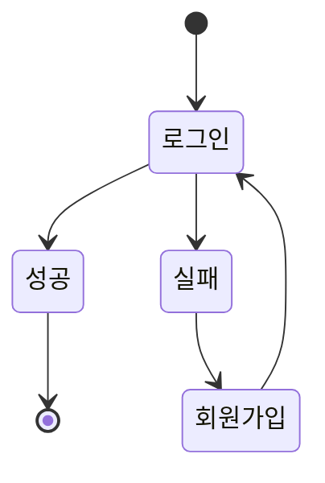

# My First Blog
- Django framework를 이용한 블로그 제작 프로젝트입니다.


## 1. 목표와 기능

### 1.1 목표
- 요리 블로그로서 다양한 사람들이 보다 손쉽게 레시피를 얻을 수 있도록 서비스하는것

### 1.2 기능
- 여러가지 자유롭게 글을 쓸 수 있는 게시판
- 음식 레시피를 유저들이 적으면 태그나 검색 기능을 통해 찾아서 볼 수 있는것
- 로그인 시 댓글이 작성 가능하다.

## 2. 개발 환경 및 배포 URL
### 2.1 개발 환경
- 개발 툴
  - Visual Studio Code 1.84.0

- Web Framework
  - Django 4.2.6

- FE
  - HTML5
  - Javascript
  - CSS

- BE
  - Python 3.12.0

## 3. 프로젝트 구조와 개발 일정
### 3.1 프로젝트 구조
```bash
C:.
|   db.sqlite3
|   manage.py
|   tree.txt
|   
+---accounts
|   |   admin.py
|   |   apps.py
|   |   forms.py
|   |   models.py
|   |   tests.py
|   |   urls.py
|   |   views.py
|   |   __init__.py
|   |   
|   +---migrations
|   |   |   0001_initial.py
|   |   |   0002_user_profile_img.py
|   |   |   __init__.py
|   |   |   
|   |   \---__pycache__
|   |           0001_initial.cpython-312.pyc
|   |           0002_user_profile_img.cpython-312.pyc
|   |           __init__.cpython-312.pyc
|   |           
|   \---__pycache__
|           admin.cpython-312.pyc
|           apps.cpython-312.pyc
|           forms.cpython-312.pyc
|           models.cpython-312.pyc
|           urls.cpython-312.pyc
|           views.cpython-312.pyc
|           __init__.cpython-312.pyc
|           
+---blog
|   |   admin.py
|   |   apps.py
|   |   forms.py
|   |   models.py
|   |   tests.py
|   |   urls.py
|   |   views.py
|   |   __init__.py
|   |   
|   +---migrations
|   |   |   0001_initial.py
|   |   |   0002_post_next_post_post_previous_post.py
|   |   |   __init__.py
|   |   |   
|   |   \---__pycache__
|   |           0001_initial.cpython-312.pyc
|   |           0002_post_next_post_post_previous_post.cpython-312.pyc
|   |           __init__.cpython-312.pyc
|   |           
|   \---__pycache__
|           admin.cpython-312.pyc
|           apps.cpython-312.pyc
|           forms.cpython-312.pyc
|           models.cpython-312.pyc
|           urls.cpython-312.pyc
|           views.cpython-312.pyc
|           __init__.cpython-312.pyc
|           
+---main
|   |   admin.py
|   |   apps.py
|   |   forms.py
|   |   models.py
|   |   tests.py
|   |   urls.py
|   |   views.py
|   |   __init__.py
|   |   
|   +---migrations
|   |   |   __init__.py
|   |   |   
|   |   \---__pycache__
|   |           __init__.cpython-312.pyc
|   |           
|   \---__pycache__
|           admin.cpython-312.pyc
|           apps.cpython-312.pyc
|           models.cpython-312.pyc
|           urls.cpython-312.pyc
|           views.cpython-312.pyc
|           __init__.cpython-312.pyc
|           
+---media
|   +---accounts
|   |   \---images
|   |       \---user_username
|   |               profile_img.jpg
|   |               
|   \---blog
|       \---images
|           \---yyyy
|               \---mm
|                   \---dd
|                           img.jpg
|                           
+---MyFirstblog
|   |   asgi.py
|   |   settings.py
|   |   urls.py
|   |   wsgi.py
|   |   __init__.py
|   |   
|   \---__pycache__
|           settings.cpython-312.pyc
|           urls.cpython-312.pyc
|           wsgi.cpython-312.pyc
|           __init__.cpython-312.pyc
|           
+---static
|   +---assets
|   |       ArrowLeft-blue.svg
|   |       ArrowTop.svg
|   |       background.jpg
|   |       blank_profile.png
|   |       Facebook.svg
|   |       Github.svg
|   |       icon-delete-white.svg
|   |       icon-delete.svg
|   |       icon-like-white.svg
|   |       icon-like.svg
|   |       icon-login.svg
|   |       icon-logout.svg
|   |       icon-modify-white.svg
|   |       icon-modify.svg
|   |       icon-postlist.svg
|   |       icon-register.svg
|   |       icon-search.svg
|   |       Instagram.svg
|   |       Logo.svg
|   |       profile.jpg
|   |       Twitter.svg
|   |       
|   +---css
|   |       about.css
|   |       author.css
|   |       banner.css
|   |       bootstrap.css
|   |       button.css
|   |       category.css
|   |       footer.css
|   |       global.css
|   |       header.css
|   |       main.css
|   |       post.css
|   |       posts.css
|   |       reset.css
|   |       view.css
|   |       wrapbox.css
|   |       
|   +---images
|   |       background.jpg
|   |       profile.jpg
|   |       project plan.png
|   |       
|   \---js
\---templates
    |   base.html
    |   
    +---accounts
    |       login.html
    |       profile.html
    |       register.html
    |       
    +---blog
    |       post_404.html
    |       post_confirm_delete.html
    |       post_detail.html
    |       post_form.html
    |       post_list.html
    |       
    \---main
            index.html
```
### 3.2 URL 구조
|app: main |views 함수 이름|html 파일이름|
|:--------|:------------|:---------|
|'/'       |index         |index.html |

|app: accounts |views 함수 이름|html 파일이름   |
|:------------|:------------|:------------|
|'login/'      |login         |login.html    |
|'logout/'     |logout        |
|'register/'     |register        |register.html   |
|'profile/'    |profile       |profile.html  |

|app: blog  |views 함수 이름  |html 파일이름   |
|:-------------|:--------------|:------------|
|'/'|PostList.as_view()|post_list.html|
|'\<int:pk\>/'|PostDetail.as_view()|post_detail.html|
|'search/'|PostSearch.as_view()|post_list.html|
|'search/\<str:tag\>/'|PostSearchTag.as_view()|post_list.html|
|'write/'|PostCreateView.as_view()|post_form.html|
|'edit/\<int:pk\>/'|PostUpdateView.as_view()|post_form.html|
|'delete/\<int:pk\>/'|PostDeleteView.as_view()|post_confirm_delete.html|

### 3.3 개발 일정(WBS)
* 일정표는 https://www.notion.so/ 에서 작성되었습니다.
* 관련된 스택 표시는 https://github.com/ 에서 작성되었습니다.


## 4. 개발자

- 총괄 및 개발 : 김찬양

## 5. UI

- 글을 작성하는 기능입니다. 카테고리는 체크박스로 적용됩니다.


- 글을 수정하거나 삭제 시 작성자만 가능하게 하였습니다.


- 특정 키워드를 이용해 검색하거나, 카테고리 명을 클릭하면 해당 카테고리를 가진 글 목록으로 이동합니다.


## 6. 데이터베이스 모델링(ERD)


## 7. 메인 기능
- 메인 탭
    - 메인화면에 최신게시물 6개와 블로그 주인의 프로필을 볼 수 있다.

- 블로그 탭
    - 각 유저마다 가입하면 글을 쓸 수 있게 되어있다. 글을 적은자나 운영자만 수정 및 삭제가 가능하다.
    - 글의 내용은 제목, 내용, 썸네일 이미지, 카테고리로 되어있다.
    - 키워드나 카테고리를 이용하여 검색이 가능하다.
    - 댓글 작성이 가능하다.

- 사용자 탭
    - 회원가입, 로그인 로그아웃 기능이 있다.

- 기타


## 8. 개발하며 느낀점
- 버그 리포트를 기능 구현마다 꾸준히 쓰고, 기능 하나당 커밋 하나를 생활화 하는게 중요한 것 같다 아직 습관화가 안되있어서 정신없이 코딩하다보면 잊어버린다.

- 생각 이상으로 많은 기능이 구현되어있지만, 정작 내가 원하는 하나가 없는경우가 꽤나 잇었다. 조금 마이너한기능을 원하는건가 싶기도 했다.

- 믹스인 등 이미 구현된 클래스를 불러와 돌리는건 간편해서 좋지만 수정하거나 오류가 뜨면 구조를 모르는것이 맹점으로 다가와 해결하기 과하게 어려워진다.

## 9. 기술 출처
- FE 기본 UI
    - https://weniv.github.io/react-blog

- Bootstrap
    - https://getbootstrap.com/